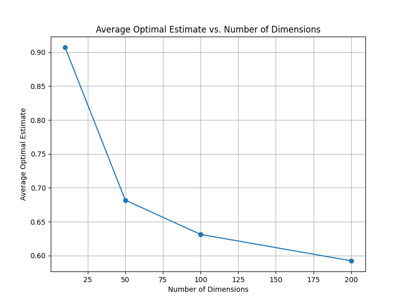

## Talagrand's Inequality and the Impact of Dimensionality

Talagrand's inequality is a powerful tool in high-dimensional probability that provides concentration bounds for empirical measures. In this analysis, we explore the relationship between the number of dimensions and the average optimal estimate calculated using Talagrand's inequality.

### Code Overview

The code provided demonstrates the application of Talagrand's inequality to calculate the optimal estimate for different numbers of dimensions and parameter values. Here's a brief overview of the code:

- The `talagrand_inequality` function calculates the concentration bound using Talagrand's inequality formula.
- The `optimal_estimate_talagrand` function computes the optimal estimate by adding the concentration bound to the empirical measure.
- The code generates random high-dimensional data and calculates the average optimal estimate for different numbers of dimensions and parameter values.
- The results are plotted using matplotlib to visualize the relationship between dimensions, parameters, and the average optimal estimate.

### Results

#### Impact of Dimensionality

The code was run with different numbers of dimensions, and the following results were obtained:

For 10 dimensions, the average optimal estimate is: 0.907
For 50 dimensions, the average optimal estimate is: 0.684
For 100 dimensions, the average optimal estimate is: 0.630
For 200 dimensions, the average optimal estimate is: 0.592

These results show that as the number of dimensions increases, the average optimal estimate decreases significantly. The plot provided further illustrates this inverse relationship, with a steep downward trend indicating a more pronounced decrease for lower dimensions.

#### Impact of Parameters

The code was also run with different parameter values (c and K) for a fixed number of dimensions (50). The results obtained were:

For parameters {'c': 0.5, 'K': 1.0}, the average optimal estimate is 0.656
For parameters {'c': 1.0, 'K': 1.0}, the average optimal estimate is 0.683
For parameters {'c': 2.0, 'K': 1.0}, the average optimal estimate is 0.730
For parameters {'c': 1.0, 'K': 0.5}, the average optimal estimate is 0.592
For parameters {'c': 1.0, 'K': 2.0}, the average optimal estimate is 0.868

These results demonstrate how the choice of parameters affects the average optimal estimate. Increasing the value of c leads to a higher average optimal estimate, while increasing K also results in a higher estimate.

### Analysis

The observed behavior can be explained by examining the formula for the concentration bound in Talagrand's inequality:

concentration_bound = K * np.sqrt((c + np.log(2)) / dimension)

As the number of dimensions (dimension) increases, the term (c + np.log(2)) / dimension decreases, resulting in a smaller concentration bound. This means that as the dimensionality of the data grows, the empirical measure becomes more concentrated around the expected measure, leading to tighter estimates.

The steep downward trend in the plot suggests that the impact of increasing dimensions on the concentration bound diminishes as the dimensionality becomes very high. This implies that the benefit of additional dimensions in terms of concentration becomes less significant beyond a certain point.

The choice of parameters (c and K) also influences the concentration bound and, consequently, the average optimal estimate. Larger values of these parameters lead to higher concentration bounds and, thus, higher average optimal estimates.

### Conclusion

Talagrand's inequality provides a powerful tool for understanding the concentration of empirical measures in high-dimensional settings. The analysis conducted demonstrates the significant impact of dimensionality on the average optimal estimate, with higher dimensions leading to tighter concentration and lower estimates. The choice of parameters also plays a role in determining the concentration bound and the resulting estimates.

This relationship highlights the importance of considering dimensionality when applying Talagrand's inequality and the effectiveness of this inequality in providing concentration bounds for high-dimensional data.

